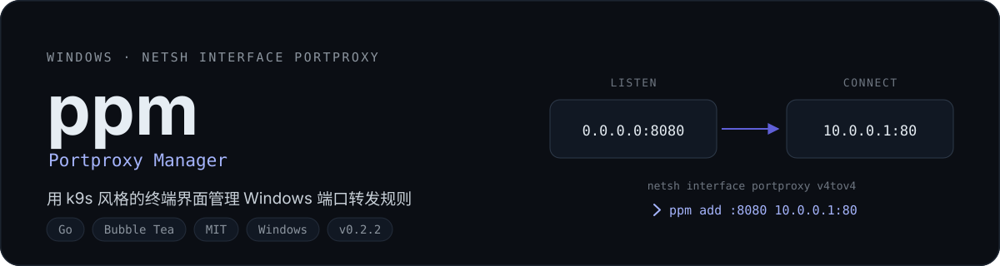
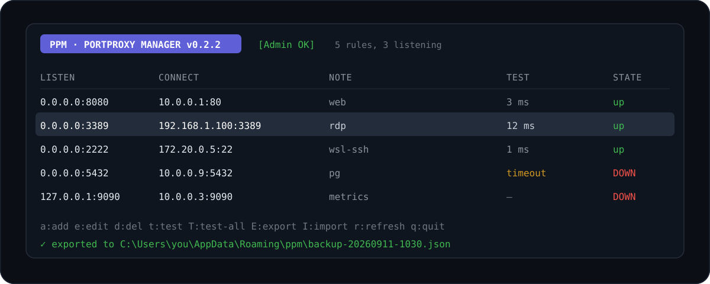
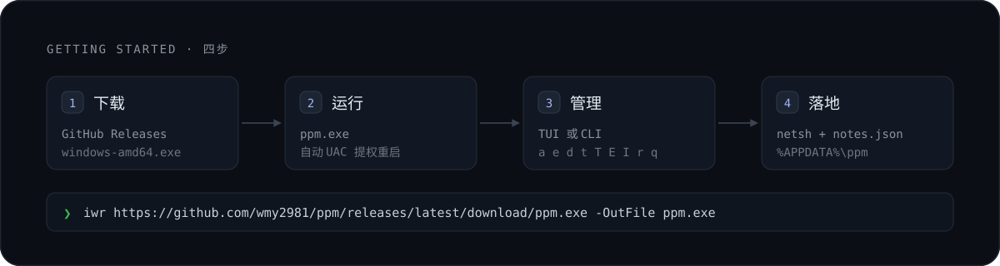
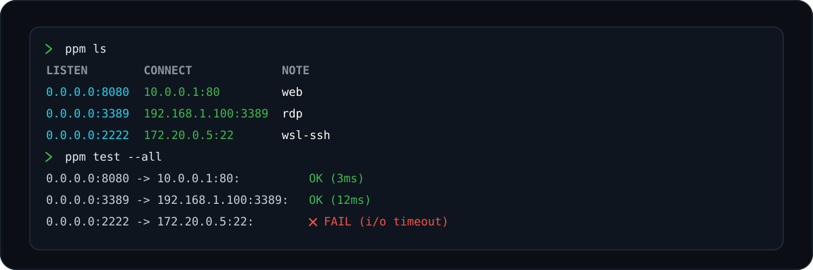

<p align="center">
  
</p>

<p align="center">
  <a href="https://github.com/wmy2981/ppm/releases/latest"></a>
  
  
  
</p>

**ppm** 把 Windows 的 `netsh interface portproxy` 变成一张可以上下翻的表格：查看、新增、编辑、删除端口转发规则都在一个终端界面里完成，还附带备注、连通性测试和监听状态检查。单个 exe，无需安装器，无运行时依赖。

> 适合把 WSL2、Docker 或内网服务的端口暴露出去，又不想每次翻 `netsh` 参数的场景。

## 界面

<p align="center">
  
</p>

## 为什么用它

`netsh interface portproxy` 本身能干活，但记不住你当初为什么加这条规则，也回答不了「这条转发现在到底通不通」。

| | `netsh` 命令行 | ppm |
|---|---|---|
| 一览所有规则 | 自己敲 `show v4tov4` 再读输出 | 表格一屏看完，支持翻页与方向键 |
| 规则备注 | 不支持 | `notes.json` 按「监听地址:端口」关联 |
| 连通性 | 手工 `Test-NetConnection` | `t` 测当前、`T` 并发测全部，显示延迟或错误原因 |
| 是否真的在监听 | 另查 `netstat` | 联查 netstat，标 `up` / `DOWN` |
| 备份与迁移 | 手抄一遍命令 | `E` 导出 JSON，`I` 导入并按监听键去重 |
| 脚本化 | 自己拼命令行 | CLI 子命令 + `--json` 输出 |

## 快速开始

从 [Releases](https://github.com/wmy2981/ppm/releases) 下载 `ppm-v<版本>-windows-amd64.exe`，改名为 `ppm.exe` 放到任意目录即可运行。

PowerShell 一条命令下载最新版并加入用户 PATH：

```powershell
$v = (Invoke-RestMethod "https://api.github.com/repos/wmy2981/ppm/releases/latest").tag_name -replace '^v',''; Invoke-WebRequest -Uri "https://github.com/wmy2981/ppm/releases/download/v$v/ppm-v$v-windows-amd64.exe" -OutFile ppm.exe; $path = [Environment]::GetEnvironmentVariable("Path", "User"); if ($path -notlike "*$PWD*") { [Environment]::SetEnvironmentVariable("Path", "$path;$PWD", "User") }; $env:Path = "$env:Path;$PWD"
```

自行构建（需要 Go 1.26）：

```powershell
git clone https://github.com/wmy2981/ppm.git
cd ppm
powershell -File .\scripts\build.ps1
```

<p align="center">
  
</p>

## 使用

直接双击或终端运行 `ppm.exe` 进入 TUI。增删规则需要管理员权限——启动时会弹 UAC 提权重启自身，拒绝则退出。

| 按键 | 操作 |
|---|---|
| `a` | 新增规则 |
| `e` / `enter` | 编辑选中规则 |
| `d` | 删除选中规则（`y` 确认 / `n` 取消） |
| `t` | 测试当前规则连通性 |
| `T` | 并发测试全部规则 |
| `E` | 导出到 `%APPDATA%\ppm\backup-YYYYMMDD-HHMMSS.json` |
| `I` | 输入备份 JSON 路径导入（合并去重，已存在的监听键跳过） |
| `r` | 手动刷新列表与监听状态 |
| `j` / `k`、方向键 | 移动光标（支持 pgup / pgdn / home / end） |
| `q` | 退出（`y` 确认 / `n` 取消） |

### CLI

无参数运行 `ppm` 进入 TUI；传入子命令则以 CLI 模式运行。

<p align="center">
  
</p>

| 子命令 | 别名 | 说明 |
|---|---|---|
| `ppm list` | `ls` | 列出所有规则 |
| `ppm add` | - | 新增规则 |
| `ppm edit` | - | 编辑规则（删除旧规则 + 创建新规则） |
| `ppm delete` | `del` | 删除一条或多条规则 |
| `ppm test` | - | 测试规则连通性 |
| `ppm export` | - | 导出全部规则和备注为 JSON 备份 |
| `ppm import` | - | 从备份文件导入规则 |
| `ppm tui` | - | 显式启动 TUI |
| `ppm version` | `ver` | 打印版本号 |

| 长写 | 短写 | 适用命令 |
|---|---|---|
| `--listen` | `-l` | `add`、`edit` |
| `--connect` | `-c` | `add`、`edit` |
| `--note` | `-n` | `add`、`edit` |
| `--json` | `-j` | `list`、`test` |
| `--output` | `-o` | `export` |

```bash
ppm ls -j                              # JSON 格式列出所有规则

ppm add :8080 10.0.0.1:80              # 等同于 0.0.0.0:8080 -> 10.0.0.1:80
ppm add :3000 10.0.0.1:3000 web        # 带备注
ppm add -l :8080 -c 10.0.0.1:80 -n web # 同上，使用 flag 形式

ppm edit :8080 -c 10.0.0.2:80          # 只改转发目标（监听地址不变）
ppm edit :8080 :9090 10.0.0.2:80       # 同时改监听地址和转发目标

ppm del :8080                          # 删除单条规则
ppm del :8080 :9090 :3000              # 批量删除多条规则

ppm test :8080                         # 测试单条规则连通性
ppm test -a                            # 测试所有规则

ppm export -o backup.json              # 导出到指定文件
ppm import backup.json                 # 从备份文件导入（去重）
```

## 数据位置

- 备注与备份文件：`%APPDATA%\ppm\`
- 备注（`notes.json`）按「监听地址:端口」键值关联规则，导出时一并写入备份

## 注意事项

- 仅支持 v4tov4 模式（IPv4 → IPv4），覆盖绝大多数场景
- portproxy 底层依赖系统服务 `iphlpsvc`，转发不生效时先检查该服务是否在运行
- 监听 `0.0.0.0` 会占用所有网卡的该端口；被占用的端口会显示 `!off` 且无法正常工作
- 编辑是「删除旧规则 + 创建新规则」——`netsh` 不支持原地更新，失败时会尽力回滚

## License

[MIT](./LICENSE)
